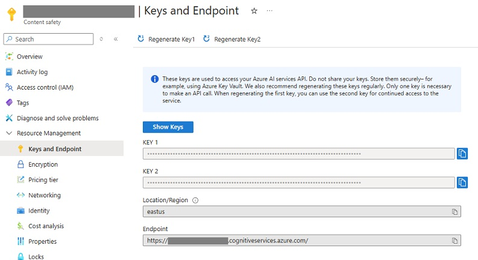
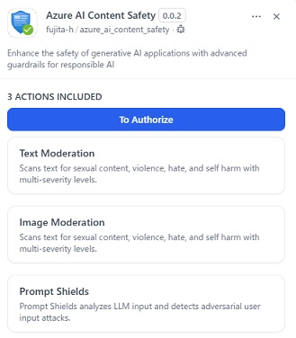
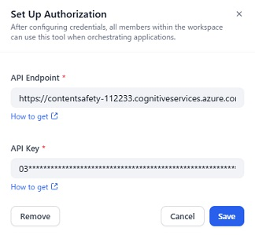
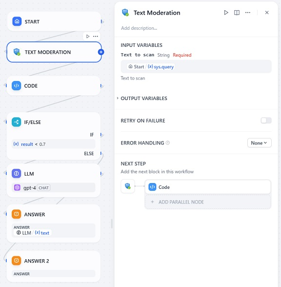

# Overview

This Plugion provides a set of tools to enhance the safety of generative AI applications with advanced guardrails for responsible AI.
Azure AI Content Safety is an AI service that detects harmful user-generated and AI-generated content in applications and services.

# Tools provided by this plugin

## Text Moderation

Scans text for sexual content, violence, hate, and self harm with multi-severity levels.

Learn more abount the text moderation categories [here](https://learn.microsoft.com/ja-jp/azure/ai-services/content-safety/concepts/harm-categories?tabs=warning).

## Image Moderation

Scans text for sexual content, violence, hate, and self harm with multi-severity levels.

Learn more abount the text moderation categories [here](https://learn.microsoft.com/ja-jp/azure/ai-services/content-safety/concepts/harm-categories?tabs=warning).

## Prompt Shields

Prompt Shields analyzes LLM input and detects adversarial user input attacks.

Learn more abount the prompt shields [here](https://learn.microsoft.com/azure/ai-services/content-safety/concepts/jailbreak-detection).

# Configuration

## 1. Create a resource in the Azure portal

Create an Azure AI Content Safety resource in the Azure portal.

## 2. Get the endpoint and key from the Azure portal

After creating the resource, get the **API Endpoint** and **API Key** from the Azure portal.

## 3. Install the plugin

Install the plugin by clicking on the **Install** button.

## 4. Authorize the plugin

Open the plugin, and click on the **To Authorize** button.

Input the **API Endpoint** and **API Key** you obtained from the Azure portal, and click on the **Save** button.

## 5. Use the tools provided by the plugin

Add tool to the canvas and configure it.

# Notes

## Supported languages

See the [official documentation](https://learn.microsoft.com/azure/ai-services/content-safety/language-support) for the supported languages.

# Report Issues and Contributing

Please report any issues to the [GitHub repository](https://github.com/fujita-h/dify-plugin-azure-ai-content-safety).  
This plugin is open-source and contributions are welcome.
